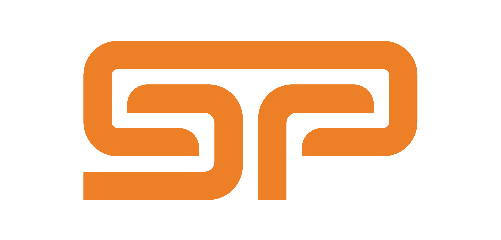

# Spin Padel



Website oficial do **Spin Padel** - O teu clube de padel na Rinchoa.

🌐 **Live Site:** [spin-padel.vercel.app](https://spin-padel.vercel.app)

---

## 📋 Sobre o Projeto

Site moderno e responsivo para o Spin Padel Club, localizado no Complexo Municipal de Fitares, Rinchoa, Sintra. O site oferece:

- 🎾 Informações sobre campos e horários
- 💰 Tabela de preços (Peak e Off-Peak)
- 👥 Apresentação da equipa
- 📰 Notícias do clube e do mundo do padel
- 🤝 Parcerias e patrocínios
- 📞 Contacto direto via WhatsApp

---

## 🛠️ Tech Stack

### Core
- **React 18.2.0** - UI library
- **Vite 5.4.0** - Build tool & dev server
- **React Router DOM 7.9.6** - Client-side routing

### Styling & Animation
- **Tailwind CSS 3.3.5** - Utility-first CSS
- **Framer Motion 10.16.4** - Animations
- **PostCSS + Autoprefixer** - CSS processing

### SEO & Meta
- **React Helmet Async** - Dynamic meta tags
- **Sitemap.xml** - Search engine indexing
- **Robots.txt** - Crawler instructions

---

## 🚀 Quick Start

### Prerequisites
- Node.js 18+
- npm or yarn

### Installation

```bash
# Clone the repository
git clone https://github.com/santamarko/spin-padel.git

# Navigate to project directory
cd spin-padel

# Install dependencies
npm install

# Start development server
npm run dev
```

The site will be available at `http://localhost:5173`

### Build for Production

```bash
npm run build
```

### Preview Production Build

```bash
npm preview
```

---

## 📁 Project Structure

```
spin-padel/
├── public/                 # Static assets
│   ├── video/             # Hero videos
│   ├── SpinPadel_*.svg    # Logo files
│   ├── robots.txt         # SEO crawler instructions
│   └── sitemap.xml        # SEO sitemap
├── src/
│   ├── components/
│   │   ├── layout/        # Navbar, Footer
│   │   ├── sections/      # Hero, Features, Pricing, etc.
│   │   ├── ui/            # Reusable UI components
│   │   └── SEO.jsx        # SEO meta tags component
│   ├── pages/             # Route pages
│   │   ├── Home.jsx
│   │   ├── PricingPage.jsx
│   │   ├── EquipaPage.jsx
│   │   ├── NoticiasPage.jsx
│   │   ├── ParceirosPage.jsx
│   │   ├── ContactoPage.jsx
│   │   └── NotFoundPage.jsx
│   ├── layouts/           # Layout wrappers
│   ├── App.jsx            # Main app with routing
│   ├── main.jsx           # Entry point
│   └── index.css          # Global styles
├── CLAUDE.md              # Development guidelines
└── README.md              # This file
```

---

## 🎨 Design System

### Brand Colors

| Color | Hex | Tailwind Class |
|-------|-----|----------------|
| Spin Blue | `#1c5ba6` | `spin-blue` |
| Spin Orange | `#ec8026` | `spin-orange` |
| Off-white | `#ece9e4` | `spin-offwhite` |
| Teal Dark | `#0e2128` | `spin-teal` |
| Black Deep | `#060606` | `spin-black` |
| Dark | `#101826` | `spin-dark` |

### Typography
- **Font:** Inter (Google Fonts)
- **Weights:** 300, 400, 500, 600, 700, 800, 900

---

## 📄 Pages

### 🏠 Home (`/`)
Landing page with video hero, features, pricing preview, and CTAs

### 💰 Preços (`/precos`)
Detailed pricing table with Peak (€46) and Off-Peak (€30) rates for 1h30 sessions

### 👥 Equipa (`/equipa`)
Team presentation with:
- Gonçalo Bettencourt (Diretor Desportivo)
- Rodrigo Mendes (Marketing & Comunicação)
- Placeholder slots for coaches and reception staff

### 📰 Notícias (`/noticias`)
- Club announcements and events
- External padel news sources (FPP, Premier Padel, Padel FIP, etc.)

### 🤝 Parceiros (`/parceiros`)
Partners page (coming soon template ready for future partnerships)

### 📞 Contacto (`/contacto`)
Contact information with:
- WhatsApp integration
- Phone & Email
- Location (Complexo Municipal de Fitares)
- Opening hours

---

## ⏰ Opening Hours

**Todos os dias:** 08:00 - 24:00

**Off-Peak:** 08:00 - 17:00 (preços reduzidos)

---

## 📱 Social Media

- Instagram: [@spinpadel](https://instagram.com/spinpadel)
- Facebook: [Spin Padel](https://facebook.com/spinpadel)
- YouTube: [@spinpadel](https://youtube.com/@spinpadel)
- TikTok: [@spinpadel](https://tiktok.com/@spinpadel)
- LinkedIn: [Spin Padel](https://linkedin.com/company/spinpadel)

---

## 🔧 Configuration

### Environment Variables

Create a `.env` file for environment-specific settings:

```env
VITE_WHATSAPP_NUMBER=351928439668
VITE_SITE_URL=https://spinpadel.pt
```

### Editing Content

#### Update Team Members
Edit `src/pages/EquipaPage.jsx` lines 17-77

#### Update News/Announcements
Edit `src/pages/NoticiasPage.jsx` lines 8-41

#### Update Pricing
Edit `src/pages/PricingPage.jsx` or `src/components/sections/Pricing.jsx`

#### Update Opening Hours
Edit:
- `src/components/layout/Footer.jsx`
- `src/pages/ContactoPage.jsx`

---

## 🚀 Deployment

### Vercel (Current)

The site is automatically deployed to Vercel on push to `main`:

```bash
# Manual deployment
vercel --prod
```

**Live URL:** [spin-padel.vercel.app](https://spin-padel.vercel.app)

### Alternative Platforms

The site can also be deployed to:
- **Netlify**
- **Cloudflare Pages**
- **GitHub Pages**
- **AWS Amplify**

Build command: `npm run build`
Output directory: `dist`

---

## 📊 SEO

- ✅ Dynamic meta tags per page (React Helmet)
- ✅ Open Graph tags for social sharing
- ✅ Sitemap.xml
- ✅ Robots.txt
- ✅ Semantic HTML structure
- ✅ Mobile-responsive design
- ✅ Fast page load times

---

## 🤝 Contributing

This is a private project for Spin Padel Club. For any suggestions or issues, please contact:

**Email:** bracosentusiastas@gmail.com
**WhatsApp:** +351 928 439 668

---

## 📝 Development Notes

See [CLAUDE.md](CLAUDE.md) for detailed development guidelines, component patterns, and best practices.

---

## 📜 License

© 2025 Spin Padel. All rights reserved.

---

## 🙏 Credits

**Development:** Built with Claude Code
**Design:** Spin Padel Team
**Location:** Complexo Municipal de Fitares, Rinchoa, Sintra

---

**Made with ❤️ and a passion for padel**
